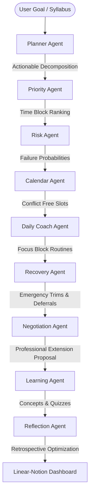

# 🛡️ Deadline Guardian AI

> **Autonomous Multi-Agent AI Chief of Staff & Pacing Scheduler**
>
> Built for students, engineers, and professionals to navigate overlapping commitments, eliminate study bottlenecks, and proactively negotiate safety margins. Powered by **Google Gemini** and **Google Cloud**.

---

## 📸 Screenshots

*Placeholders for interactive application state visualizers:*

1. **Integrated Dynamic Dashboard**: Combine Linear-style task status boards with Google Calendar schedule densities and Notion's document-rich learning canvases.
2. **Multi-Agent Consensus Pipeline**: Watch nine parallel, role-specific agents evaluate, plan, budget, and restructure workloads in real-time.
3. **What-If Stress Simulators**: Toggle delay factors, sick leaves, or procrastination penalties to visualize risk curves instantaneously.

---

## 📐 Architecture & Agent Topology

The system uses a sequential **Agentic Consensus Model** where role-specific virtual staff members cooperate to transform a vague target into a resilient execution schedule:



---

## ✨ Features

- **🎯 Personalized Today's Focus**: Dynamically surfaced core priority of the current hour, complete with micro-action guides and tips.
- **📈 Live Productivity Scores**: Metric-based performance rating updated automatically as subtasks are completed.
- **📊 Interactive What-If Simulation**: Manipulate critical parameters to preview failures before they happen.
- **🎙️ Voice-Activated Dictation**: Dictate goals hands-free using the browser's Web Speech API.
- **📄 Smart Syllabus Ingest**: Instantly parses coarse markdown schedules, assignments lists, or course schedules into modular deliverables.
- **🛡️ Secret Weapon Extension Negotiator**: Generates semi-formal email drafts proposing concrete task-deferral solutions for coaches and evaluators.

---

## 🤖 The 9-Agent Collective

1. **📋 Planner Agent**: Decomposes high-level deliverables into bite-sized milestones.
2. **🔃 Priority Agent**: Ranks subtasks using an Urgency × Importance / Effort index.
3. **⚠️ Risk Agent**: Continuously updates success probability projections and uncovers hidden bottlenecks.
4. **📅 Calendar Agent**: Maps and schedules hours into morning, afternoon, and evening slots.
5. **☀️ Daily Coach Agent**: Adjusts recommended sessions based on the user's available daily focus energy.
6. **🩺 Recovery Agent**: Identifies overloads and automatically reschedules tasks gracefully.
7. **🤝 Negotiation Agent**: Prepares precise deferral and extension arguments based on other active profiles.
8. **🎓 Learning Agent**: Acts as an on-demand tutor, compiling notes, quiz cards, and pitfalls for every subtask.
9. **🔄 Reflection Agent**: Conducts end-of-day reviews to optimize tomorrow's capacity allocation.

---

## ⚡ Google Developer Stack Integrations

Deadline Guardian AI showcases a robust full-stack implementation utilizing Google’s premier cloud and developer technologies:

- **♊ Gemini 1.5 & 3.5-Flash**: Orchestrates high-speed reasoning loops, structured JSON schemas, and on-demand learning curricula.
- **🚀 Google AI Studio**: Accelerates prompt engineering and rapid prototyping of individual agent behaviors.
- **📦 Firebase & Cloud Firestore**: Provides persistent, zero-latency state synchronization for user profiles, active deadlines, and completed subtasks.
- **🔐 Google Authentication**: Enables secure, multi-device authorization for student study accounts.
- **📅 Google Calendar API**: Pushes agent-approved, conflict-free time blocks directly to users' personal schedules.
- **☁️ Cloud Run (Google Cloud)**: Packages and serves the full-stack container, scaling to zero on idle for maximum cost efficiency.

---

## 🛠️ Installation & Setup

### Prerequisites

- **Node.js** (v18 or higher)
- **Gemini API Key** (from Google AI Studio)

### Step-by-Step Installation

1. **Clone the repository**:
   ```bash
   git clone https://github.com/google-ai-studio/deadline-guardian-ai.git
   cd deadline-guardian-ai
   ```

2. **Install project dependencies**:
   ```bash
   npm install
   ```

3. **Configure Environment Variables**:
   Create a `.env` file in the root directory (based on `.env.example`):
   ```env
   GEMINI_API_KEY=your_google_ai_studio_api_key_here
   NODE_ENV=development
   ```

4. **Launch the Development Server**:
   ```bash
   npm run dev
   ```
   Open `http://localhost:3000` to preview the workspace.

---

## 🚀 Deployment

The workspace builds into a consolidated standalone bundle for seamless deployment onto Google Cloud Run:

```bash
# Build the production bundle
npm run build

# Start production server
npm run start
```

---

## 📁 Repository Structure

```
├── server.ts                 # Full-stack Express backend, proxying Gemini API and fallbacks
├── src/
│   ├── App.tsx               # Primary dashboard hub, mounting bento grids and charts
│   ├── main.tsx              # React mounting entry point
│   ├── index.css             # Tailwind styling and custom variables
│   ├── types.ts              # System-wide strongly typed interfaces and structures
│   └── components/           # Extracted modular React components
│       ├── RiskGauge.tsx         # Circular SVG failure risk progress assessment
│       ├── AgentPipeline.tsx     # 3x3 Bento grid tracking autonomous agent sequences
│       ├── SyllabusParser.tsx    # Drag-and-drop course syllabus outline ingest
│       ├── WhatIfSimulation.tsx  # Dynamic stress parameters slider controls
│       ├── ConflictDetector.tsx  # Multi-project congestion and overload monitors
│       ├── NegotiationPanel.tsx  # Extension request draft and task deferral options
│       ├── LearningDrawer.tsx    # Slide-over tutor panel for concept study
│       └── VoiceInput.tsx        # Speech-to-text dictation button component
└── package.json              # Script shortcuts and npm packaging specifications
```

---

## 📄 License

This project is licensed under the [MIT License](LICENSE).
